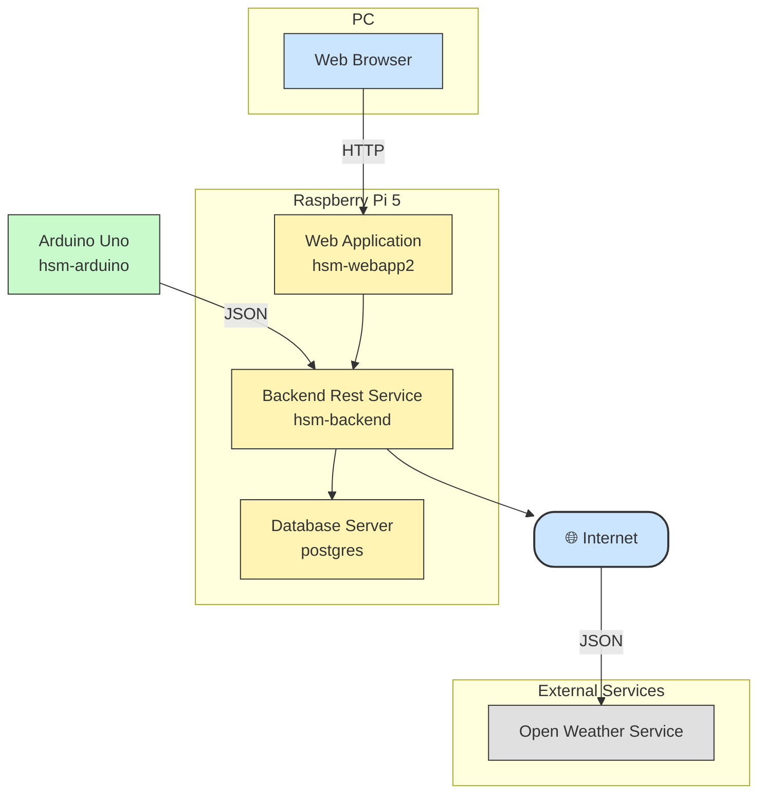

# Temperature Measurements REST Service

A Python REST API service for receiving and managing temperature measurements from multiple sensors.

## Features

- Rest Service and database for HSM

## Architecture



## Useful DB Snippets

```
docker exec -it <sha> /bin/bash
psql -U hsmuser -d hsm

select count(*) from temperature_measurements;
select * from temperature_measurements order by timestamp desc limit 15;
select * from sensors;
```
